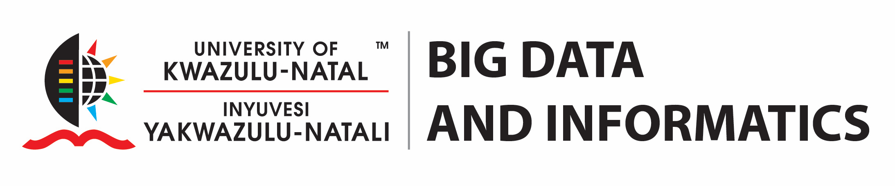

<!-- See instructions in the comments below for how to edit specific sections of this workshop template. -->

<table>

	<tr>
	<td align="center" style="background-color:white" style="width:30%"></td>
	<td align="center" style="background-color:white" style="width:30%"></td>
	</tr>
</table>

<!--
  HEADER

  Edit the values in the block above to be appropriate for your workshop.
  If the value is not 'true', 'false', 'null', or a number, please use
  double quotation marks around the value, unless specified otherwise.
  And run 'tools/check' *before* committing to make sure that changes are good.
-->

<!--
  EVENTBRITE

  This block includes the Eventbrite registration widget if
  'eventbrite' has been set in the header.  You can delete it if you
  are not using Eventbrite, or leave it in, since it will not be
  displayed if the 'eventbrite' field in the header is not set.
-->

<iframe
  src="https://www.eventbrite.com/tickets-external?eid={{page.eventbrite}}&ref=etckt"
  frameborder="0"
  width="100%"
  height="248px"
  scrolling="auto">
</iframe>


<h2 id="general">General Information</h2>

<!--
  INTRODUCTION

  Edit the general explanatory paragraph below if you want to change
  the pitch.
-->

  The course is aimed at everyone who is
  interested in becoming a better teacher. In particular, this training
  is aimed at those who want to become <a href="{{ site.swc_site }}">Software Carpentry</a>,
  <a href="{{ site.dc_site }}">Data Carpentry</a>, and <a href="{{ site.lc_site }}">Library Carpentry</a>
  instructors, run workshops and contribute to the Carpentry training
  materials. You don't currently have to be an instructor or a
  teacher to attend this workshop, but you do need to be willing and
  committed to becoming one and to improving your teaching techniques.

  The workshop is a mix of lectures and hands-on lessons where you
  practice giving a short lesson using approaches learned and
  implement some of the teaching techniques which we will discuss.
  This is training for teaching, not technical training; you do not
  need any particular technical background, and we will not be
  teaching that. This workshop is based on the constantly revised and
  updated
 <a href="{{ site.training_site }}">curriculum</a>.

  <a href="{{ site.swc_site }}">Software Carpentry</a>,
  <a href="{{ site.dc_site }}">Data Carpentry</a>, and
  <a href="{{ site.lc_site }}">Library Carpentry</a>'s mission is to
  help scientists, researchers, and librarians get more research done in less time
  and with less pain by teaching them basic lab skills for scientific
  computing.  This hands-on two-day workshop covers the basics of
  educational psychology and instructional design, and looks at how to
  use these ideas in both intensive workshops and regular classes.

<!--
  LOCATION

  This block displays the address and links to maps showing directions
  if the latitude and longitude of the workshop have been set.  You
  can use http://itouchmap.com/latlong.html to find the lat/long of an
  address.
-->


  <strong>Where:</strong>
  {{page.address}}.
  Get directions with
  <a href="//www.openstreetmap.org/?mlat={{page.latlng | replace:',','&mlon='}}&zoom=16">OpenStreetMap</a>
  or
  <a href="//maps.google.com/maps?q={{page.latlng}}">Google Maps</a>.



  <strong>Requirements:</strong> Participants should bring a laptop
  that is Internet connected and has a functioning browser.  If you
  have it, a device for recording audio and video (mobile phones and
  laptops are OK) is useful as throughout the two days, we are going
  to record one another teaching in pairs or threes.  It does not have
  to be high-quality, but it should be good enough that you can
  understand what someone is saying.

  Please note that after this course is over, you will be asked to do
  three short follow-up exercises online in order to finish qualifying
  as an instructor: the details are available at
  <a href="{{ site.training_site }}/checkout/">{{ site.training_site }}/checkout/</a>.
  If you have any questions about the workshop, the reading material,
  or anything else, please get in touch.

  <em>
    All participants are required to abide by The Carpentries'
    <a href="{{ site.swc_site }}/conduct/">Code of Conduct</a>.
  </em>

  <strong>Accessibility:</strong> We are committed to making this workshop
  accessible to everybody. If we can help making learning easier for
  you please get in touch (using contact details below).
	

<!--
  The workshop organisers have checked that:

<ul>
  <li>The room is wheelchair / scooter accessible.</li>
  <li>Accessible restrooms are available.</li>
</ul>

  Materials will be provided in advance of the workshop and
  large-print handouts are available if needed by notifying the
  organizers in advance.  If we can help making learning easier for
  you (e.g. sign-language interpreters, lactation facilities) please
  get in touch (using contact details below) and we will
  attempt to provide them.

-->

<strong>Applications:</strong> Please register your application by completing the form available at <a href="https://goo.gl/forms/ys7XkRc6u1OHGV6H2">https://goo.gl/forms/ys7XkRc6u1OHGV6H2</a>.
Please note the two-step application process - first register your application by completing the Google Form linked above, then complete the full application available at <a href="https://amy.software-carpentry.org/forms/request_training/">https://amy.software-carpentry.org/forms/request_training/</a> using the group name "UKZN2019".

<strong>Cost:</strong> The workshop is free of charge. Workshop costs are sponsored by UKZN's Capacity Development Programme and the DHET's Rural Campus Connectivity Project II. Participants coming from rural institutions in KwaZulu-Natal or the Eastern Cape can apply for travel sponsorship.

  <strong>Contact</strong>:
  Please email
  
    
      
        or
      
        
        ,
        
      
      <a href='mailto:{{contact}}'>{{contact}}</a>
    
  
    to-be-announced
  
  for more information.

<h2 id="preparation" name="preparation">Preparation</h2>

  Please read the following before the workshop begins:

<ol>
  <li><a href="{{ site.training_site }}/papers/science-of-learning-2015.pdf">The Science of Learning</a></li>
</ol>

  Please also read through <em>one</em> episode of of the Carpentries lessons below   
  carefully, so that you can do some exercises based on it on the
  first day of the class.  An episode is one page of a lesson.

  <ul>
  <li><a href="{{ site.swc_site }}/lessons">Software Carpentry Lessons</a></li>
  <li><a href="{{ site.dc_site }}/lessons">Data Carpentry Lessons</a></li>
  <li><a href="{{ site.lc_site }}/lessons">Library Carpentry Lessons</a></li>
  </ul>

<h2 id="surveys">Surveys</h2>

<h3 id="pre_workshop_survey">Pre-training survey</h3>

  Before attending the workshop, please fill out <a href="{{ site.instructor_pre_survey }}{{ site.github.project_title }}">our pre-training survey</a>.

<h3 id ="post_workshop_survey">Post-training survey</h3>

  After attending the workshop, please fill out <a href="{{ site.instructor_post_survey }}{{ site.github.project_title }}"> our post-training survey</a>

<h2 id="schedule" name="schedule">Schedule</h2>

  

    <h3>Day 1</h3>
    <table class="table table-striped">
    <tr> <td>08:30</td> <td>Welcome </td> </tr>
    <tr> <td>09:00</td> <td>How Learning Works </td> </tr>
    <tr> <td>10:30</td> <td>Refreshment Break</td> </tr>
    <tr> <td>11:00</td> <td>How Learning Works/ Building Teaching Skill </td> </tr>
    <tr> <td>12:30</td> <td>Lunch </td> </tr>
    <tr> <td>13:30</td> <td>Creating a Positive Learning Environment </td> </tr>
    <tr> <td>15:15</td> <td>Afternoon Break </td> </tr>
    <tr> <td>15:35</td> <td>Building Teaching Skill </td> </tr>
    <tr> <td>16:35</td> <td>Wrap-Up and Homework for Tomorrow </td> </tr>
    <tr> <td>17:00</td> <td>Finish </td> </tr>
    </table>
  

  

    <h3>Day 2</h3>
    <table class="table table-striped">
    <tr> <td>08:30</td> <td>Welcome Back </td> </tr>
    <tr> <td>08:45</td> <td>Building Teaching Skill </td> </tr>
    <tr> <td>10:30</td> <td>Refreshment Break </td> </tr>
    <tr> <td>11:00</td> <td>Building Teaching Skill </td> </tr>
    <tr> <td>12:30</td> <td>Lunch </td> </tr>
    <tr> <td>13:30</td> <td>The Carpentries</td> </tr>
    <tr> <td>15:15</td> <td>Afternoon Break </td> </tr>
    <tr> <td>15:35</td> <td>The Carpentries </td> </tr>
    <tr> <td>16:35</td> <td>Afternoon Wrap-Up </td> </tr>
    <tr> <td>17:00</td> <td>Finish </td> </tr>
    </table>
  

  

    <h3>Day 3</h3>
    <table class="table table-striped">
    <tr> <td>08:30</td> <td>Welcome Back </td> </tr>
    <tr> <td>08:45</td> <td>Mentoring within the Carpentries </td> </tr>
    <tr> <td>09:45</td> <td>Lesson Onboarding Sessions </td> </tr>
    <tr> <td>10:30</td> <td>Refreshment Break </td> </tr>
    <tr> <td>11:00</td> <td>Workshop Planning at your university </td> </tr>
    <tr> <td>12:30</td> <td>Lunch </td> </tr>
    <tr> <td>13:00</td> <td>Finish</td> </tr>
    </table>
  

<!--

  

    <h3>Day 1</h3>
    <table class="table table-striped">
      <tr> <td>09:00</td> <td>Welcome </td> </tr>
      <tr> <td>09:30</td> <td>How Learning Works: The Importance of Practice </td> </tr>
      <tr> <td>10:20</td> <td>How Learning Works: Expertise and Instruction </td> </tr>
      <tr> <td>11:10</td> <td>Morning Coffee </td> </tr>
      <tr> <td>11:25</td> <td>How Learning Works: Working Memory and Cognitive Load </td> </tr>
      <tr> <td>12:15</td> <td>Building Teaching Skill: Getting Feedback </td> </tr>
      <tr> <td>12:35</td> <td>Lunch </td> </tr>
      <tr> <td>13:35</td> <td>Creating a Positive Learning Environment: Motivation and Demotivation </td> </tr>
      <tr> <td>14:40</td> <td>Creating a Positive Learning Environment: Mindset </td> </tr>
      <tr> <td>15:20</td> <td>Afternoon Coffee </td> </tr>
      <tr> <td>15:35</td> <td>Building Teaching Skill: The Importance of Practice </td> </tr>
      <tr> <td>16:45</td> <td>Wrap-Up and Homework for Tomorrow </td> </tr>
      <tr> <td>17:05</td> <td>Finish </td> </tr>
    </table>
  

  

    <h3>Day 2</h3>
    <table class="table table-striped">
      <tr> <td>09:00</td> <td>Welcome Back </td> </tr>
      <tr> <td>09:10</td> <td>Building Teaching Skill: Lesson Study </td> </tr>
      <tr> <td>10:05</td> <td>Building Teaching Skill: Live Coding </td> </tr>
      <tr> <td>11:05</td> <td>Morning Coffee </td> </tr>
      <tr> <td>11:20</td> <td>Building Teaching Skill: Performance Revised </td> </tr>
      <tr> <td>12:00</td> <td>Lunch </td> </tr>
      <tr> <td>13:00</td> <td>The Carpentries: Workshop Introductions </td> </tr>
      <tr> <td>14:10</td> <td>The Carpentries: How We Operate </td> </tr>
      <tr> <td>15:15</td> <td>Afternoon Coffee </td> </tr>
      <tr> <td>15:30</td> <td>The Carpentries: Teaching Practices </td> </tr>
      <tr> <td>16:00</td> <td>Afternoon Wrap-Up </td> </tr>
      <tr> <td>16:45</td> <td>Finish </td> </tr>
    </table>
  

-->

<!--
  ETHERPAD

  At `_misc/etherpad.txt` you will find a template for the etherpad.

  Display the Etherpad for the workshop.  You can set this up in
  advance or on the first day; either way, make sure you push changes
  to GitHub after you have its URL.  To create an Etherpad, go to

      http://pad.software-carpentry.org/YYYY-MM-DD-site

  where 'YYYY-MM-DD-site' is the identifier for your workshop,
  e.g., '2015-06-10-esu'.
-->


  <strong>Etherpad:</strong> <a href="{{page.etherpad}}">{{page.etherpad}}</a>.
   
  We will use this Etherpad for chatting, taking notes, and sharing URLs and bits of code.



<h2 id="materials" name="materials">Training Materials and detailed schedule</h2>

  Please see <a href="{{ site.training_site }}">this site</a> for course material.

